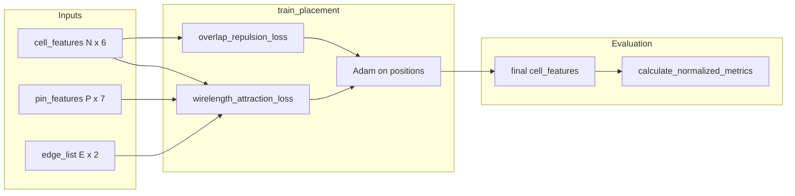

# Onboarding: `placement.py` library

This document orients new contributors to the VLSI-style **cell placement** code in [`placement.py`](placement.py): what it does, how data is laid out, the public API (inputs, outputs, purpose), and where performance matters.

---

## Problem and geometry

The library optimizes **2D positions** of rectangular **cells** (macros and standard cells) so that:

1. **Overlap is minimized** (primary objective in the challenge).
2. **Wirelength** between connected **pins** is reduced (secondary).

**Convention:** Each cell is an axis-aligned rectangle **centered** at `(x, y)` with given `width` and `height`. Overlap between two cells is computed from center-to-center separation versus half-widths and half-heights (same criterion everywhere: strict separation when `|dx| == (w_i + w_j)/2` is treated as non-overlapping in the vectorized checks via `<`).

In **`generate_placement_input`**, pin `PIN_X` / `PIN_Y` are sampled in **cell-local** coordinates from the cell’s **lower-left** (between margins and the cell width/height). **`wirelength_attraction_loss`** forms world coordinates as **`cell_center + (PIN_X, PIN_Y)`** (same columns each step), so only `cell_features[:, 2:4]` is optimized; be aware this mixes “center + offset” with offsets that were generated from the lower-left frame.

---

## Quick mental model

---

## Main modules of responsibility

| Section | Role |
|--------|------|
| **Setup** | Synthetic netlist generation (`generate_placement_input`). |
| **Optimization** | Differentiable losses and `train_placement` (the part you typically edit). |
| **Evaluation** | Non-differentiable metrics for reporting and tests (`calculate_*`). |
| **Visualization** | Optional Matplotlib plots (`plot_*`). |
| **Demo** | `main()` end-to-end script. |

The test harness [`test.py`](test.py) imports `generate_placement_input`, `train_placement`, and `calculate_normalized_metrics`.

---

## Data structures

### `CellFeatureIdx` / `PinFeatureIdx`

`IntEnum` types indexing columns of feature tensors. Prefer these over magic numbers.

### `cell_features` — shape `[N, 6]`

| Index | Name (enum) | Meaning |
|------|----------------|---------|
| 0 | `AREA` | Cell area (scalar used in normalization and generation). |
| 1 | `NUM_PINS` | Pin count for that cell (informational / generation). |
| 2 | `X` | Cell center **x** (optimized in training). |
| 3 | `Y` | Cell center **y** (optimized in training). |
| 4 | `WIDTH` | Full width of the rectangle. |
| 5 | `HEIGHT` | Full height of the rectangle. |

Only columns **2–3** receive gradients during `train_placement`; other columns are fixed physical parameters.

### `pin_features` — shape `[P, 7]`

| Index | Name (enum) | Meaning |
|------|----------------|---------|
| 0 | `CELL_IDX` | Index of owning cell in `[0, N)`. |
| 1 | `PIN_X` | Pin offset **x** relative to cell (used in loss). |
| 2 | `PIN_Y` | Pin offset **y** relative to cell (used in loss). |
| 3 | `X` | Absolute **x** at init / legacy column (loss does not rely on staying updated). |
| 4 | `Y` | Absolute **y** at init / legacy column. |
| 5 | `WIDTH` | Pin width (e.g. 0.1). |
| 6 | `HEIGHT` | Pin height. |

**Note:** `wirelength_attraction_loss` uses **cell centers + columns 1–2** (not columns 3–4, which are not kept in sync during training).

### `edge_list` — shape `[E, 2]`, `dtype` long

Each row is `[src_pin_idx, tgt_pin_idx]` into `pin_features`. Undirected connectivity is represented as one row per edge (order may follow generation logic).

---

## Public API reference

### `generate_placement_input(num_macros, num_std_cells)`

| | |
|--|--|
| **Input** | Two nonnegative integers: macro count, standard-cell count. |
| **Output** | `(cell_features, pin_features, edge_list)` as described above. |
| **Utility** | Builds a random synthetic design: macro areas in `[MIN_MACRO_AREA, MAX_MACRO_AREA]`, standard cells from `STANDARD_CELL_AREAS`, random pins per cell, random edges with deduplication. Prints a short summary. |

Implementation mixes vectorized tensor ops with Python loops over cells/pins for pin placement and edge wiring.

---

### `wirelength_attraction_loss(cell_features, pin_features, edge_list)`

| | |
|--|--|
| **Input** | Full feature tensors and edge list. |
| **Output** | Scalar `torch.Tensor`: mean per-edge cost (sum of edge terms divided by `E`). |
| **Utility** | Differentiable **wirelength proxy**: absolute pins = `cell_positions[cell_indices] + pin_features[:, 1:3]`; for each edge, nonnegative `dx, dy` from `abs` differences; **`alpha * logsumexp([dx/α, dy/α])`** on the two axes (a smooth **maximum**-like blend of the separations, not `dx + dy`). `alpha = 0.1`. Returns **0** with `requires_grad=True` if `E == 0`. |

**Vectorization:** Indexing `pin_absolute_*` by `src_pins` and `tgt_pins` avoids Python loops over edges.

---

### `overlap_repulsion_loss(cell_features, pin_features, edge_list, mode="fast")`

| | |
|--|--|
| **Input** | `cell_features`; `pin_features` and `edge_list` are **ignored** (deleted) but kept for a uniform call signature with wirelength loss. |
| **Output** | Scalar differentiable penalty. |
| **Utility** | Penalizes axis-aligned overlap between all **unordered** pairs (upper triangle only). Modes: **`fast`** — sum of overlap areas divided by `(count_overlapping_pairs + 1)`; **`area`** / **`squared`** / **`both`** — mean overlap area and/or mean squared overlap area over `N(N-1)/2` pairs. |

**Vectorization:** `N×N` tensors via `unsqueeze` broadcast for `dx`, `dy`, `min_sep_*`, `relu` penetration, and `torch.triu` mask.

---

### `_fast_overlap_ratio(cell_features)` (private)

| | |
|--|--|
| **Input** | `cell_features` `[N, 6]`. |
| **Output** | Python `float`: fraction of cells that participate in **at least one** overlap. |
| **Utility** | Fast, **vectorized** estimate aligned with the overlap definition used in `calculate_cells_with_overlaps` (strict `<` on separations). Used during training for optional plot annotations. |

---

### `_lr_cosine_anneal(progress, lr_max, lr_min_frac=0.1)` (private)

| | |
|--|--|
| **Input** | `progress` in `[0, 1]`, peak LR, minimum fraction of peak. |
| **Output** | Scalar learning rate. |
| **Utility** | Cosine decay from `lr_max` down to `lr_max * lr_min_frac`. |

---

### `train_placement(cell_features, pin_features, edge_list, ...)`

| | |
|--|--|
| **Input** | Initial features and graph. Defaults (overridable): `num_epochs=10000`, `lr=0.05`, `lambda_wirelength=0.1`, `lambda_overlap=50`, `overlap_loss_mode="fast"`, `verbose=True`, `log_interval=100`, optional `loss_plot_path`, `overlap_ratio_tag_interval=2000`, `per_cell_grad_clip_norm=2.44343` (or `None` to disable clipping). |
| **Output** | `dict` with `final_cell_features`, `initial_cell_features`, `loss_history`, `lambda_wirelength`, `lambda_overlap`, `num_epochs`. |
| **Utility** | Runs **Adam** on a detached `cell_positions` tensor (columns 2–3 only). Each epoch: **`_lr_cosine_anneal(epoch/span, lr)`** sets the optimizer LR (`span = max(num_epochs-1, 1)`). **`λ_wl` and `λ_ol` are fixed** for the whole run (`lambda_wirelength`, `lambda_overlap`). Forward: `total_loss = λ_wl * L_wl + λ_ol * L_ol`; backward; optional **per-cell** L2 grad clip; `optimizer.step()`. `loss_history` records raw/weighted losses, **constant** `scheduled_lambda_wl` / `scheduled_lambda_ol`, `learning_rate`, and optional `overlap_ratio_tags` when `overlap_ratio_tag_interval` is nonzero. Optional loss figure via `plot_training_loss_curves`. |

**Training graph:** `cell_features` is cloned; each epoch builds `cell_features_current` by copying and injecting `cell_positions` into columns 2–3, so the backward path flows into `cell_positions` only.

---

### `calculate_overlap_metrics(cell_features)`

| | |
|--|--|
| **Input** | `cell_features` `[N, 6]`. |
| **Output** | `dict`: `overlap_count` (pair count), `total_overlap_area`, `max_overlap_area`, `overlap_percentage` (implemented as `(overlap_count / N) * 100` when `total_area > 0`). |
| **Utility** | **Ground-truth** reporting using NumPy loops over pairs; **not** differentiable. |

---

### `calculate_cells_with_overlaps(cell_features)`

| | |
|--|--|
| **Input** | `cell_features` `[N, 6]`. |
| **Output** | Python `set` of cell indices that appear in at least one overlapping pair. |
| **Utility** | Defines the **official overlap_ratio** used in tests: `len(set) / N`. |

---

### `calculate_normalized_metrics(cell_features, pin_features, edge_list)`

| | |
|--|--|
| **Input** | Final placement tensors. |
| **Output** | `dict`: `overlap_ratio`, `normalized_wl`, `num_cells_with_overlaps`, `total_cells`, `num_nets`. |
| **Utility** | Single entry point for leaderboard-style metrics: overlap from `calculate_cells_with_overlaps`; wirelength from `wirelength_attraction_loss` × `E` then `(total_wirelength / num_nets) / sqrt(total_area)`. |

---

### `plot_placement(initial_cell_features, final_cell_features, pin_features, edge_list, filename=...)`

| | |
|--|--|
| **Input** | Initial/final cells, pins, edges; output basename. |
| **Output** | Writes PNG under `OUTPUT_DIR` (script directory) unless `filename` is absolute. |
| **Utility** | Side-by-side rectangles + overlap summary text; requires Matplotlib. |

---

### `plot_training_loss_curves(loss_history, lambda_wirelength, lambda_overlap, filename=...)`

| | |
|--|--|
| **Input** | History dict from `train_placement`; lambdas for title. |
| **Output** | Saves a 2×2 figure (log-scaled curves + overlap share + annotations from `overlap_ratio_tags`). |
| **Utility** | Debugging convergence; optional dependency on Matplotlib/NumPy. |

Nested helper `_positive_log_y` masks non-positive/non-finite values for log axes.

---

### `main()`

| | |
|--|--|
| **Input** | None (uses fixed demo sizes and seed). |
| **Output** | Console logs, optional plots, success/fail message. |
| **Utility** | Demonstrates full pipeline: generate → random radial spread → train → metrics → `plot_placement`. |

---

## Runtime and memory notes

### Where work scales as **O(N²)**

- **`overlap_repulsion_loss`:** Builds `N×N` pairwise tensors. Dominates cost for large `N` on GPU/CPU. Fully **vectorized** (no pair loop in Python).
- **`_fast_overlap_ratio`:** Same pairwise structure; **vectorized**; `any` over rows for “cell has any overlap.”
- **`calculate_overlap_metrics` / `calculate_cells_with_overlaps`:** **Double Python loops** over pairs — simpler but slower for large `N`. Evaluation is usually run once per test, not per epoch.

### Where work scales as **O(E)** or **O(P)**

- **`wirelength_attraction_loss`:** O(P) indexing for pin absolutes, O(E) edge reduction. **Vectorized** along edges.

### Training loop overhead

- Each epoch: **`cell_features.clone()`** plus assignment of positions — allocates a full `[N, 6]` tensor every step. For huge `N`, reducing clones (e.g. only swapping in position columns without full tensor duplicate) would be a possible optimization; current code favors clarity and correct autograd wiring into `cell_positions`.

### Differentiable overlap

- **`relu(min_sep - |delta|)`** gives zero gradient when pairs are separated; gradients flow only through overlapping pairs. **`fast`** mode changes magnitude via divide-by-overlap-count (+1), which can affect gradient scaling when few pairs overlap.

### Device

- Code assumes a single default tensor device (typically CPU in the reference harness). For CUDA, ensure all tensors (`mask`, constants) live on the same device as `cell_features` — `overlap_repulsion_loss` already uses `device=x.device` for the upper-triangular mask.

### Optional plotting

- Matplotlib is **lazy-imported** inside plotting functions so headless / CI runs without the dependency until you plot.

---

## Related files

| File | Role |
|------|------|
| [`test.py`](test.py) | Batch runs `TEST_CASES` with `train_placement(..., verbose=False)`; prints per-test metrics and an **aggregate** block (average overlap, average normalized wirelength, total runtime) plus a one-line summary at the end. |
| [`tune_optuna.py`](tune_optuna.py) | Hyperparameter search (external to core library API). |
| [`README.md`](README.md) | Challenge statement and leaderboard. |

---

Welcome aboard — when changing losses or training, keep **tensor shapes**, **centered-rectangle geometry**, and **test metrics** (`calculate_cells_with_overlaps` + normalized wirelength) consistent with this document.
