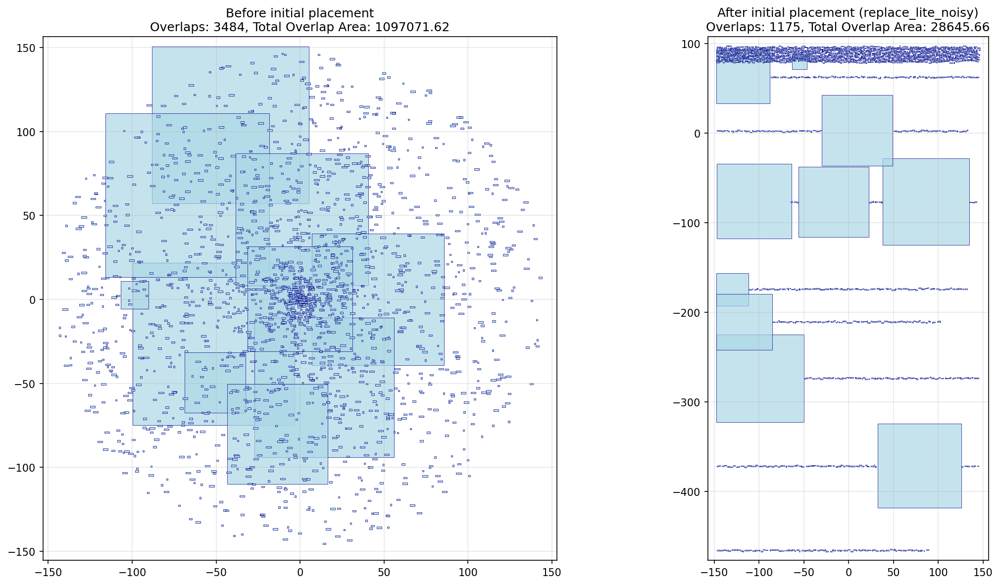

# VLSI Cell Placement — Writeup

## Overview

I tired a variety of methods to achieve optimal results. The core issue was in balancing the competing demands of overlap loss and wire length loss, which have generally contradictory impaces on the total gradient. This report goes over the many things I tried to overcome this and summarizes the issues I encountered and the results I achieved.

## Optimization
I tried a variety of optimization technniques, including various learning rates, optimizers (SGD w/ Nesterov momentum vs Adam) and a range of values for the associated hyperparamters.

A notable improvement was achieved by dividing the process into two phases: overlap dominant and wire length dominant, each of these dictated by different lambdas. I added both head and tail versions for overlap dominant occuring at the beginning and end of the training run. These phases are triggered both by the epoch number and a miniumum threshhold for overlap loss. I also tried various learning rate schedulers such constant, cosine annealing, cosine with warm restarts, exponential, linear, one cycle, step and multi-step. And I ran with a variety of epoch numbers.

# Hyperparameter Search
These parameters and the parameters discussed below were selected using grid search methods across the parameter space to find the optimal hyperparamters.

# Monitoring
In order to view the evolution of the placement across the training run, I save the plots along the way, as well as for the plots before and after the various initialization methods explained below. I also added logic to capture the best historical run from the entire process of training rather than just returning the final run. This allows it to benefit from noisy exploration. Since we don't care about only the final outcome, it can jump around and select the best result in the entire process.

# Initialization
I tried a variety of initialization methods, which reposition all the cells before the start of training:

- Randomization: cell positions are assigned randomly within a specified region to allow flexible starting configurations.
- RePlAce-based initialization: uses a light version of the RePlAce algorithm to spread cells efficiently and minimize initial overlaps.
- ePlace-based initialization: applies a light version of the ePlace algorithm, which uses electrostatics-inspired placement to achieve a balanced spread.
- Quadratic analytic solution: determines positions by solving a system that models nets as springs, resulting in an initial placement minimizing quadratic wirelength.
- Spectral clustering: uses graph partitioning on the connectivity of the netlist to place highly-connected cells close together.

<figure>
  
  <figcaption align="center"><b>Figure:</b> Example of RePlAce-based initialization</figcaption>
</figure>

I also experimented with hybrids that combine each of these methods with added randomness to enhance diversity in initial placements.

# Perturbation
I found that the training often appeared to get stuck at local minima. Therefore, I felt that some form of perturbation might help it escape these minima (since momentum methods alone didn't seem to achieve this.) I added greedy swaps that randomly swap two non-macro cells, scoring the WL loss before and after and only accepting if the loss is improved. The max number of swaps per turn and the swap period were hyperparameters to be adjusted. Macros were avoided because their size made the inevitiability of large overlaps impractical. I also implemented random noise kicks, which simpled injected noise into the positions of all the cells. Both of these perturbations were periodic and gated by loss thresholds, only occuring if WL loss was too high.

# Analytics
The `calculate_min_possible_normalized_wl` function estimates a theoretical lower bound on normalized wirelength for a placement. It works by calculating, for each net, the minimum possible WL if the pins or cells connected to the net were all positioned at their geometric median, thus ignoring any physical or design constraints. This gives a baseline for what the optimal WL would be in an unconstrained scenario. Meanwhile, `print_adjacency_matrix_and_stats` prints the graph's adjacency matrix along with key stats, like node degree distribution, number of isolated nodes, and density, providing insight into the netlist’s connectivity, presence of hubs, and structural bottlenecks. These metrics were useful for understanding lower bounds.

# Density loss
Due to the competing gradients between WL and overlap, I thought trying another loss based on density might serve as a proxy for overlap, without overpowering the gradient like the original overlap loss. This density loss works by dividing the layout area into a grid and summing the excess area of cells falling within each grid bin, applying a penalty whenever the local density in a bin exceeds a target threshold. This loss function is controlled by parameters such as the grid bin size (which determines the spatial resolution for density estimation), penalty exponent (which sets how strongly to penalize overfull regions), kernel radius (controlling the spread of each cell’s influence), and the target density, which can be annealed over the course of training. We also tried combining this with the overlap loss for various lambda values.

# Efficiency

This project is designed to run on the available device, be in GPU, MPS or lastly CPU. I used Google Colab to run the longer test runs on GPU. I also tried to improve runtime efficiency by making a sliding window based version of the overlap method that is O(N * W) (where W is the number of windows) instead of O(N * N) but it is paradoxically slower for smaller input sizes. This is because the oridinary version uses full tensor math to calculate the result while the sliding window version doesn't. However, for larger inputs it should be more efficient. This was an attempt to handle the large realistic test cases, but they are still very slow.

# Bugs Found
I found two key bugs in the provided function for wire length loss. One is that the Manhattan distance provided is actually a smooth max of the two axis distances rather than Manhattan distance. I implemented a smooth Manhattan distance function but left the original version of this function as a basis for comparison against the leaderboard. The other is that this file uses the X, Y position of the cells to mean its center position in some places but the bottom left corner of the cell in the WL loss function. This can lead to some miscalculations. This is most easily addressed by adapting it to use the center in that function, which I have provided, but I also kept the origin code for leaderboard compatibility. All bug fix code is prefixed with the comment "BUG FIX".

# Result
The best parameters I found are the ones used when `train_placement` is called from `test.py`. This mostly used the function defaults but I have some overrides there for efficiency. Most notably, the strategy of a WL phase followed by an overlap phase seemed to work the best. Both phases use a combined loss favoring the dominant loss heavily. Also, of all the initialization methods used, the one that worked the best was spectral clustering. However, this method is too slow for larger nets so "replace-lite-noisy" was used instead. Also, the greedy swaps seemed to help but were again too slow for the larger nets.

# Summary
The key difficulty of this problem is the competition between the gradients. Overlap loss pushes the cells apart while wire length loss pulls them together. I believe this is the reason why the learning curves didn't alway show steady improvement; these competing gradients tended to cancel out and impede learning. I tried multiple strategies around this in order to escape local minima, such as various learning parameters, different phases of training (WL or overlap focused), various initialization and perturbation methods to try to jump start the placement into a more favorable part of the loss landscape and also adding a new type of density loss rather than training solely on overlap loss. Overall, this was a fun assignment. I learned a lot about the challenges implicit in this problem, and I am very curious about other techniques for solving it.
