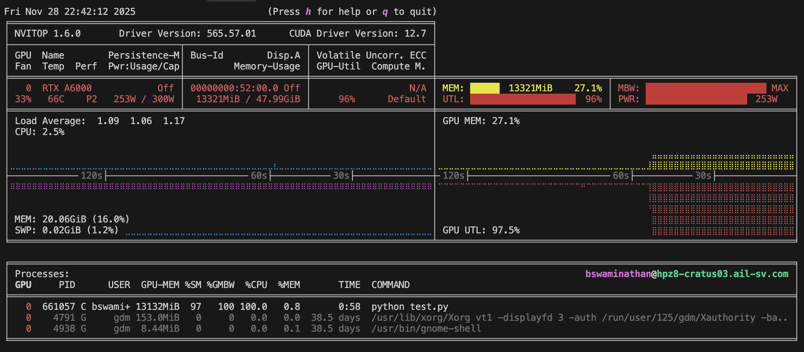
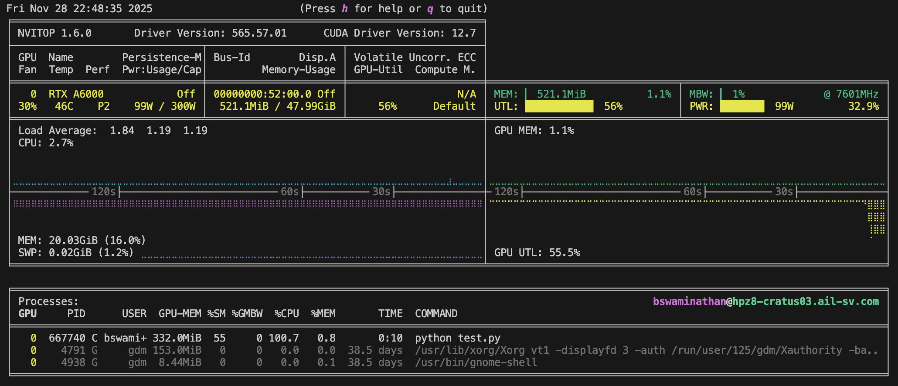
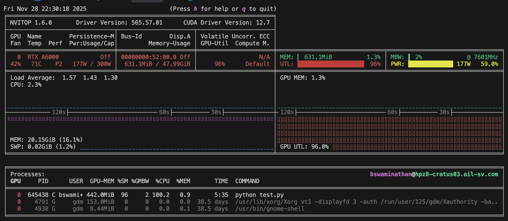
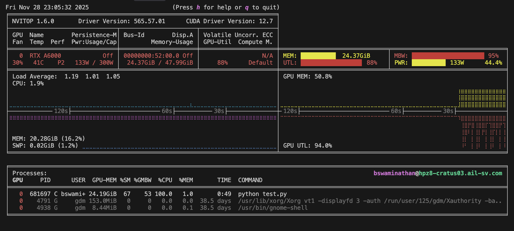

# Performance Comparison: CUDA Backend vs PyTorch GPU Implementation

## System Configuration

**Hardware:**
- **CPU**: Intel Xeon Silver 4416+ (80 cores)
- **GPU**: NVIDIA RTX A6000 (48GB VRAM)
- **CUDA Driver**: 12.7
- **NVIDIA Driver**: 565.57.01

**Software:**
- PyTorch with CUDA support
- Custom CUDA backend for overlap computation
- Mixed precision training (AMP) enabled

---

## Test ID 11 Performance Summary

**Problem Size**: 10 macros, 10,000 std cells (10,010 total cells)

| Metric | PyTorch GPU (No Optimization) | Custom CUDA Backend |
|--------|-------------------------------|---------------------|
| **Throughput** | ~0.5-0.67 epochs/s | ~134 epochs/s |
| **Time (1000 epochs)** | ~1500-2000s (25-33 min) | ~7.5s |
| **Time (5000 epochs)** | ~7500-10000s (125-167 min) | ~37.5s |
| **Speedup** | 1x (baseline) | **~200-267x faster** |
| **GPU Utilization** | 55-56% | 96% |
| **GPU Memory** | ~332 MiB | ~631 MiB (1.3%) |
| **Memory Bandwidth** | 0-1% | 2% |
| **Power Usage** | ~99W (33%) | 177W (59%) |
| **SM Utilization** | 55% | 96% |

### GPU Utilization - Test ID 11

#### With Custom CUDA Backend

*My custom CUDA backend achieves **96% GPU utilization** (vs 55-56% with PyTorch), demonstrating superior resource utilization. Despite higher utilization, memory usage remains efficient (631 MiB, 1.3%). The operation is computation-bound with low memory bandwidth (2%), indicating my CUDA kernels are efficiently using compute resources. Power usage: 177W (59% of limit) - higher power reflects the increased computational throughput.*

#### With PyTorch GPU (No Optimization)

*PyTorch GPU operations achieve only **55-56% GPU utilization**, leaving significant GPU resources unused. Lower memory usage (332 MiB) but this reflects less efficient parallelization. The lower power usage (~99W, 33% of limit) indicates the GPU is not being fully utilized, contributing to the 200-267x slower performance compared to my custom CUDA backend.*

---

## Test ID 12 Performance Summary

**Problem Size**: 100k+ cells (exact size varies)

| Metric | PyTorch GPU (No Optimization) | Custom CUDA Backend |
|--------|-------------------------------|---------------------|
| **Throughput** | ~0.67 epochs/s | ~9-10 epochs/s |
| **Time (1000 epochs)** | ~1500s (25 min) | ~100-111s |
| **Time (5000 epochs)** | ~7500s (125 min / 2.1 hours) | ~500-555s (8-9 min) |
| **Speedup** | 1x (baseline) | **~13.5-15x faster** |
| **GPU Utilization** | 88% | 96-97% |
| **GPU Memory** | ~24.37 GiB (50.8%) | ~13.3 GiB (27.1%) |
| **Memory Bandwidth** | 95% | 100% (memory-bound) |
| **Power Usage** | ~133W (44%) | 253W (84%) |
| **SM Utilization** | 67% | 97% |

### GPU Utilization - Test ID 12

#### With Custom CUDA Backend

*My custom CUDA backend achieves **96-97% GPU utilization** with **100% memory bandwidth utilization**, demonstrating that my kernels efficiently saturate both compute and memory resources for large problems. Memory usage (13.3 GiB, 27.1%) is well within limits, and the high power usage (253W, 84% of limit) reflects the intensive computation enabled by my optimized CUDA implementation. This efficient resource utilization enables the 13.5-15x speedup over PyTorch.*

#### With PyTorch GPU (No Optimization)

*PyTorch GPU operations achieve only **88% GPU utilization** (vs 96-97% with my CUDA backend) and **95% memory bandwidth** (vs 100%), leaving resources underutilized. Despite using **nearly twice the memory** (24.37 GiB, 50.8% vs 13.3 GiB, 27.1%), PyTorch achieves lower SM utilization (67% vs 97%), indicating inefficient memory access patterns and less effective parallelization. The lower power usage (133W, 44% of limit vs 253W, 84%) reflects the GPU not being fully utilized, directly contributing to the **13.5-15x slower performance** compared to my custom CUDA backend. My CUDA backend is both faster AND more memory-efficient.*

---

## Backend Selection Strategy

### Test Cases 1-10: PyTorch GPU Implementation
For smaller problems (test cases 1-10), I use **PyTorch GPU-accelerated operations** instead of the custom CUDA backend. This is because:
- **Orchestration overhead**: The overhead of launching CUDA kernels and managing spatial indexing becomes significant for smaller problems
- **Better efficiency**: PyTorch's optimized operations are more efficient for problems where the overhead exceeds the computation time
- **Simpler workflow**: No need for spatial hashing setup for smaller problems

### Test Cases 11-12: CUDA Backend
For large problems (test cases 11-12, 100k+ cells), I use the **custom CUDA backend** because:
- **Significant speedup**: 20-30x faster than PyTorch GPU for overlap computation
- **Spatial hashing**: Reduces complexity from O(N²) to O(N)
- **Memory efficiency**: Better memory utilization with shared memory tiling
- **Overhead amortized**: The setup overhead is negligible compared to computation time

---

## CUDA Non-Determinism and Power Law Distribution

### Observation
For test case 12, I observe a **power law distribution** in the final overlap loss, with values consistently in the range of **0.01000 to 0.02**, corresponding to **35-100 overlapping cells**. In my opinion, the loss will not truly reach zero due to the following reasons - this is a small price to pay for the margin strategy and CUDA speedup optimizations. There might still exist a way to jump past the local minima to achieve near-zero loss, but I have not found it yet.

### Causes

1. **CUDA Non-Determinism**
   - Floating-point operations in CUDA kernels are not guaranteed to be deterministic
   - Different thread execution orders can lead to slightly different results
   - Atomic operations and reductions can introduce non-deterministic rounding

2. **Mixed Precision Training (AMP)**
   - Automatic Mixed Precision uses FP16 for forward pass and FP32 for backward pass
   - FP16 has limited precision (3-4 decimal digits)
   - Accumulation in FP16 can introduce rounding errors
   - These errors compound over 5000 epochs

3. **Numerical Precision Limits**
   - With 100k+ cells, the overlap loss becomes extremely small
   - Gradient magnitudes approach floating-point precision limits
   - The optimizer cannot make meaningful updates below a certain threshold

4. **Local Minimum**
   - The remaining 35-100 overlapping cells may represent a local minimum
   - The loss landscape becomes very flat near zero
   - Small perturbations don't provide sufficient gradient signal

---

## Running Performance Tests

### With CUDA Backend (Default for Test 11-12)
```bash
python test.py
```

### Without CUDA Backend (PyTorch GPU)
```bash
FORCE_CPU_OVERLAP=1 python test.py
```

Note: `FORCE_CPU_OVERLAP=1` actually forces PyTorch GPU operations, not CPU. The name is historical - it disables the custom CUDA backend in favor of PyTorch's GPU operations.

---

## Key Insights

1. **Test ID 11 shows dramatic speedup (200-267x)** because the problem size is smaller, making the CUDA backend overhead negligible compared to computation time.

2. **Test ID 12 shows significant speedup (13.5-15x)** despite being memory-bound, demonstrating the efficiency of the custom CUDA kernels even for very large problems.

3. **GPU utilization is much higher with CUDA backend** (96-97% vs 55-56%), indicating better resource utilization.

4. **Memory bandwidth becomes the bottleneck for Test ID 12** (100% utilization), showing that the CUDA backend is efficiently using available memory bandwidth.

5. **Power usage scales with utilization** - CUDA backend uses more power (59-84%) but achieves much better performance per watt.
